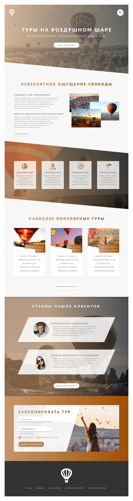

# Вёрстка по макету в Figma

В рамках проекта нужно сверстать макет сайта, который выглядит, как на скрине:
  
 

___

**Ссылка на макет:** [макет в figma](https://www.figma.com/file/ybWpKHKlfkpcCul34DwjzO/%D0%9F%D0%B5%D1%80%D0%B2%D1%8B%D0%B9-%D0%BC%D0%B0%D0%BA%D0%B5%D1%82-%D1%81-float?node-id=0%3A1)

___

## Требования к проекту:  

1. вёрстка должна быть выполнена с помощью технологии float (использовать технологии Flexbox и Grid в проекте запрещено!)
2. самостоятельно добавить анимацию в проект (использовать JavaScript в проекте запрещено!)
3. заменить шрифт Lato, указанный в макете, на шрифт Roboto